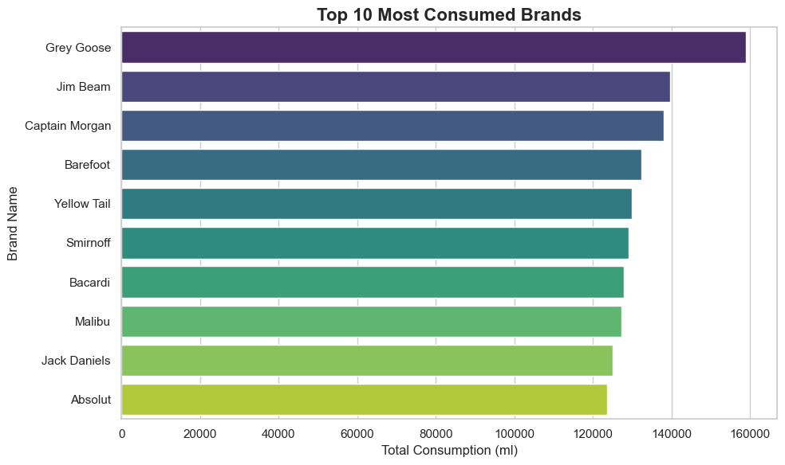

# Hotel Inventory Forecasting & Recommendation System

This project aims to help a hotel chain optimize its bar inventory by forecasting weekly item consumption and recommending optimal inventory levels (par levels). This reduces stockouts, prevents overstocking, cuts costs, and improves guest satisfaction.

- by Izhan Abdullah A


```python

```

## 1. Core Business Problem and Its Importance

- The hotel has multiple bars across locations.
- Frequent stockouts of popular items and overstocking of slow-moving items cause extra costs and unhappy customers.
- Forecasting demand helps maintain the right stock levels, saving money and improving guest experience.

## 2. Assumptions Made

- Weekly data is sufficient to observe demand trends.
- Demand changes gradually without sudden spikes.
- One-week lead time for restocking.
- A safety stock of 15% is enough to avoid shortages.
- Past consumption patterns are expected to continue in the short term.

These assumptions simplify the problem but can be refined with more data or business feedback.

## 3. Model Used and Why

- Used Holt-Winters Exponential Smoothing with an additive trend.
- It models level and trend well and is simple and fast.
- Other models like ARIMA or machine learning were not chosen due to complexity and lack of strong seasonality in data.


## 4. System Performance and Possible Improvements

- Forecast accuracy is good with low Mean Absolute Error (MAE).
- Could improve by adding seasonality or external factors (events, promotions).
- Safety stock calculation can be more advanced using demand variability.
- Real-time data integration could make forecasts more responsive.


## 5. Real-World Deployment

- Weekly updated inventory recommendations would be provided to bar managers.
- Helps reduce stockouts and overstocking.
- Saves costs and improves customer satisfaction.


## Scaling Challenges and Monitoring

- Large data volume may slow processing.
- Data quality and delays can impact forecast accuracy.
- Important to monitor forecast errors, stockouts, and waste regularly.
- Set alerts for unusual demand changes.
    


```python

```


```python

```

# Step 1: Import Libraries

#### Import all required Python libraries for data handling, visualization, and forecasting.


```python
import pandas as pd
import matplotlib.pyplot as plt
import seaborn as sns
from statsmodels.tsa.holtwinters import ExponentialSmoothing
import numpy as np
```

# Step 2: Load Data

#### Load the dataset and preview the first few rows to understand its structure.


```python
df = pd.read_csv("Consumption Dataset - Dataset.csv")
print("First 5 rows of raw data")
```

    First 5 rows of raw data
    


```python
df.head()
```


<div>
<style scoped>
    .dataframe tbody tr th:only-of-type {
        vertical-align: middle;
    }

    .dataframe tbody tr th {
        vertical-align: top;
    }

    .dataframe thead th {
        text-align: right;
    }
</style>
<table border="1" class="dataframe">
  <thead>
    <tr style="text-align: right;">
      <th></th>
      <th>Date Time Served</th>
      <th>Bar Name</th>
      <th>Alcohol Type</th>
      <th>Brand Name</th>
      <th>Opening Balance (ml)</th>
      <th>Purchase (ml)</th>
      <th>Consumed (ml)</th>
      <th>Closing Balance (ml)</th>
    </tr>
  </thead>
  <tbody>
    <tr>
      <th>0</th>
      <td>1/1/2023 19:35</td>
      <td>Smith's Bar</td>
      <td>Rum</td>
      <td>Captain Morgan</td>
      <td>2555.04</td>
      <td>1824.84</td>
      <td>0.0</td>
      <td>4379.88</td>
    </tr>
    <tr>
      <th>1</th>
      <td>1/1/2023 10:07</td>
      <td>Smith's Bar</td>
      <td>Wine</td>
      <td>Yellow Tail</td>
      <td>1344.37</td>
      <td>0.00</td>
      <td>0.0</td>
      <td>1344.37</td>
    </tr>
    <tr>
      <th>2</th>
      <td>1/1/2023 11:26</td>
      <td>Johnson's Bar</td>
      <td>Vodka</td>
      <td>Grey Goose</td>
      <td>1034.28</td>
      <td>0.00</td>
      <td>0.0</td>
      <td>1034.28</td>
    </tr>
    <tr>
      <th>3</th>
      <td>1/1/2023 13:53</td>
      <td>Johnson's Bar</td>
      <td>Beer</td>
      <td>Coors</td>
      <td>2194.53</td>
      <td>0.00</td>
      <td>0.0</td>
      <td>2194.53</td>
    </tr>
    <tr>
      <th>4</th>
      <td>1/1/2023 22:28</td>
      <td>Johnson's Bar</td>
      <td>Wine</td>
      <td>Yellow Tail</td>
      <td>1020.90</td>
      <td>0.00</td>
      <td>0.0</td>
      <td>1020.90</td>
    </tr>
  </tbody>
</table>
</div>


```python

```

# Step 3: Data Preprocessing

####  Clean and transform data, convert dates, and extract features needed for analysis.

### Convert datetime and extract features


```python
df['Date Time Served'] = pd.to_datetime(df['Date Time Served'])
df['Date'] = df['Date Time Served'].dt.date
df['Week'] = df['Date Time Served'].dt.isocalendar().week
df['Year'] = df['Date Time Served'].dt.year
```


```python
df[['Date Time Served', 'Date', 'Week', 'Year']].head()
```


<div>
<style scoped>
    .dataframe tbody tr th:only-of-type {
        vertical-align: middle;
    }

    .dataframe tbody tr th {
        vertical-align: top;
    }

    .dataframe thead th {
        text-align: right;
    }
</style>
<table border="1" class="dataframe">
  <thead>
    <tr style="text-align: right;">
      <th></th>
      <th>Date Time Served</th>
      <th>Date</th>
      <th>Week</th>
      <th>Year</th>
    </tr>
  </thead>
  <tbody>
    <tr>
      <th>0</th>
      <td>2023-01-01 19:35:00</td>
      <td>2023-01-01</td>
      <td>52</td>
      <td>2023</td>
    </tr>
    <tr>
      <th>1</th>
      <td>2023-01-01 10:07:00</td>
      <td>2023-01-01</td>
      <td>52</td>
      <td>2023</td>
    </tr>
    <tr>
      <th>2</th>
      <td>2023-01-01 11:26:00</td>
      <td>2023-01-01</td>
      <td>52</td>
      <td>2023</td>
    </tr>
    <tr>
      <th>3</th>
      <td>2023-01-01 13:53:00</td>
      <td>2023-01-01</td>
      <td>52</td>
      <td>2023</td>
    </tr>
    <tr>
      <th>4</th>
      <td>2023-01-01 22:28:00</td>
      <td>2023-01-01</td>
      <td>52</td>
      <td>2023</td>
    </tr>
  </tbody>
</table>
</div>


### Aggregate weekly consumption per Bar + Brand


##### Group data by week, bar, and brand to get total weekly consumption.


```python
weekly_consumption = df.groupby(['Year', 'Week', 'Bar Name', 'Brand Name'])['Consumed (ml)'].sum().reset_index()
```


```python
print(weekly_consumption.head())
```

       Year  Week        Bar Name    Brand Name  Consumed (ml)
    0  2023     1  Anderson's Bar       Absolut        1309.92
    1  2023     1  Anderson's Bar       Bacardi         216.80
    2  2023     1  Anderson's Bar      Barefoot         479.09
    3  2023     1  Anderson's Bar         Coors        1258.76
    4  2023     1  Anderson's Bar  Jack Daniels         124.16
    


```python
weekly_consumption.head()
```


<div>
<style scoped>
    .dataframe tbody tr th:only-of-type {
        vertical-align: middle;
    }

    .dataframe tbody tr th {
        vertical-align: top;
    }

    .dataframe thead th {
        text-align: right;
    }
</style>
<table border="1" class="dataframe">
  <thead>
    <tr style="text-align: right;">
      <th></th>
      <th>Year</th>
      <th>Week</th>
      <th>Bar Name</th>
      <th>Brand Name</th>
      <th>Consumed (ml)</th>
    </tr>
  </thead>
  <tbody>
    <tr>
      <th>0</th>
      <td>2023</td>
      <td>1</td>
      <td>Anderson's Bar</td>
      <td>Absolut</td>
      <td>1309.92</td>
    </tr>
    <tr>
      <th>1</th>
      <td>2023</td>
      <td>1</td>
      <td>Anderson's Bar</td>
      <td>Bacardi</td>
      <td>216.80</td>
    </tr>
    <tr>
      <th>2</th>
      <td>2023</td>
      <td>1</td>
      <td>Anderson's Bar</td>
      <td>Barefoot</td>
      <td>479.09</td>
    </tr>
    <tr>
      <th>3</th>
      <td>2023</td>
      <td>1</td>
      <td>Anderson's Bar</td>
      <td>Coors</td>
      <td>1258.76</td>
    </tr>
    <tr>
      <th>4</th>
      <td>2023</td>
      <td>1</td>
      <td>Anderson's Bar</td>
      <td>Jack Daniels</td>
      <td>124.16</td>
    </tr>
  </tbody>
</table>
</div>


```python

```

# Step 4: Exploratory Data Analysis

#### Analyze consumption patterns and visualize top brands by total sales.

### Top 10 consumed brands


```python
sns.set(style="whitegrid")

```


```python
top_brands_df = top_brands.reset_index()
top_brands_df.columns = ['Brand Name', 'Total Consumed (ml)']
```


```python
plt.figure(figsize=(10, 6))
sns.barplot(
    data=top_brands_df,
    x='Total Consumed (ml)',
    y='Brand Name',
    hue='Brand Name',
    dodge=False,
    palette="viridis",
    legend=False
)

plt.title('Top 10 Most Consumed Brands', fontsize=16, fontweight='bold')
plt.xlabel("Total Consumption (ml)", fontsize=12)
plt.ylabel("Brand Name", fontsize=12)
plt.tight_layout()
plt.show()
```


    

    


```python
top_brands_df
```


<div>
<style scoped>
    .dataframe tbody tr th:only-of-type {
        vertical-align: middle;
    }

    .dataframe tbody tr th {
        vertical-align: top;
    }

    .dataframe thead th {
        text-align: right;
    }
</style>
<table border="1" class="dataframe">
  <thead>
    <tr style="text-align: right;">
      <th></th>
      <th>Brand Name</th>
      <th>Total Consumed (ml)</th>
    </tr>
  </thead>
  <tbody>
    <tr>
      <th>0</th>
      <td>Grey Goose</td>
      <td>158924.02</td>
    </tr>
    <tr>
      <th>1</th>
      <td>Jim Beam</td>
      <td>139702.43</td>
    </tr>
    <tr>
      <th>2</th>
      <td>Captain Morgan</td>
      <td>138035.53</td>
    </tr>
    <tr>
      <th>3</th>
      <td>Barefoot</td>
      <td>132312.95</td>
    </tr>
    <tr>
      <th>4</th>
      <td>Yellow Tail</td>
      <td>129843.65</td>
    </tr>
    <tr>
      <th>5</th>
      <td>Smirnoff</td>
      <td>129176.67</td>
    </tr>
    <tr>
      <th>6</th>
      <td>Bacardi</td>
      <td>127951.80</td>
    </tr>
    <tr>
      <th>7</th>
      <td>Malibu</td>
      <td>127279.51</td>
    </tr>
    <tr>
      <th>8</th>
      <td>Jack Daniels</td>
      <td>125050.89</td>
    </tr>
    <tr>
      <th>9</th>
      <td>Absolut</td>
      <td>123659.02</td>
    </tr>
  </tbody>
</table>
</div>


```python

```

# Step 5: Time Series Forecasting

#### Build and fit forecasting models to predict future demand for key bar-brand combinations.


```python
# Identify top 3 most consumed (Bar Name, Brand Name) combinations
top_combos = (
    df.groupby(['Bar Name', 'Brand Name'])['Consumed (ml)']
    .sum()
    .sort_values(ascending=False)
    .head(50)  
    .index
)
```


```python
forecast_results = {}

# Loop
for bar, brand in top_combos:
    print(f"\nProcessing Forecast for: {brand} at {bar}")
    
    # Extract time series
    ts = weekly_consumption[
        (weekly_consumption['Bar Name'] == bar) &
        (weekly_consumption['Brand Name'] == brand)
    ].copy()

    ts['Date'] = pd.to_datetime(ts['Year'].astype(str) + '-' + ts['Week'].astype(str) + '-1', format="%Y-%W-%w")
    ts.set_index('Date', inplace=True)
    ts = ts['Consumed (ml)'].resample('W-MON').sum().fillna(0)

    model = ExponentialSmoothing(ts, trend='add')
    model_fit = model.fit()

    forecast = model_fit.forecast(4)

    forecast_results[(bar, brand)] = {
        'history': ts,
        'forecast': forecast
    }

    # Display result
    print("Weekly Forecast for Next 4 Weeks:")
    for i, (date, value) in enumerate(forecast.items(), start=1):
        print(f"  Week {i} ({date.date()}): {round(value, 2)} ml")

    print("Forecast complete for this combination.\n" + "-"*60)
```

    
    Processing Forecast for: Yellow Tail at Brown's Bar
    Weekly Forecast for Next 4 Weeks:
      Week 1 (2024-01-01): 618.46 ml
      Week 2 (2024-01-08): 620.76 ml
      Week 3 (2024-01-15): 623.05 ml
      Week 4 (2024-01-22): 625.35 ml
    Forecast complete for this combination.
    ------------------------------------------------------------
    
    Processing Forecast for: Grey Goose at Thomas's Bar
    Weekly Forecast for Next 4 Weeks:
      Week 1 (2024-01-01): 722.4 ml
      Week 2 (2024-01-08): 723.97 ml
      Week 3 (2024-01-15): 725.53 ml
      Week 4 (2024-01-22): 727.1 ml
    Forecast complete for this combination.
    ------------------------------------------------------------
    
    Processing Forecast for: Captain Morgan at Johnson's Bar
    Weekly Forecast for Next 4 Weeks:
      Week 1 (2024-01-01): 506.66 ml
      Week 2 (2024-01-08): 503.83 ml
      Week 3 (2024-01-15): 501.01 ml
      Week 4 (2024-01-22): 498.18 ml
    Forecast complete for this combination.
    ------------------------------------------------------------
    
    Processing Forecast for: Grey Goose at Taylor's Bar
    Weekly Forecast for Next 4 Weeks:
      Week 1 (2023-12-18): 662.94 ml
      Week 2 (2023-12-25): 658.9 ml
      Week 3 (2024-01-01): 654.87 ml
      Week 4 (2024-01-08): 650.84 ml
    Forecast complete for this combination.
    ------------------------------------------------------------
    
    Processing Forecast for: Grey Goose at Brown's Bar
    Weekly Forecast for Next 4 Weeks:
      Week 1 (2024-01-01): 569.81 ml
      Week 2 (2024-01-08): 570.2 ml
      Week 3 (2024-01-15): 570.6 ml
      Week 4 (2024-01-22): 570.99 ml
    Forecast complete for this combination.
    ------------------------------------------------------------
    
    Processing Forecast for: Absolut at Smith's Bar
    Weekly Forecast for Next 4 Weeks:
      Week 1 (2024-01-01): 370.02 ml
      Week 2 (2024-01-08): 338.88 ml
      Week 3 (2024-01-15): 307.74 ml
      Week 4 (2024-01-22): 276.6 ml
    Forecast complete for this combination.
    ------------------------------------------------------------
    
    Processing Forecast for: Captain Morgan at Anderson's Bar
    Weekly Forecast for Next 4 Weeks:
      Week 1 (2023-12-25): 554.95 ml
      Week 2 (2024-01-01): 554.41 ml
      Week 3 (2024-01-08): 553.87 ml
      Week 4 (2024-01-15): 553.33 ml
    Forecast complete for this combination.
    ------------------------------------------------------------
    
    Processing Forecast for: Barefoot at Anderson's Bar
    Weekly Forecast for Next 4 Weeks:
      Week 1 (2024-01-01): 407.7 ml
      Week 2 (2024-01-08): 404.41 ml
      Week 3 (2024-01-15): 401.13 ml
      Week 4 (2024-01-22): 397.85 ml
    Forecast complete for this combination.
    ------------------------------------------------------------
    
    Processing Forecast for: Malibu at Johnson's Bar
    Weekly Forecast for Next 4 Weeks:
      Week 1 (2024-01-08): 489.29 ml
      Week 2 (2024-01-15): 472.57 ml
      Week 3 (2024-01-22): 455.86 ml
      Week 4 (2024-01-29): 439.14 ml
    Forecast complete for this combination.
    ------------------------------------------------------------
    
    Processing Forecast for: Absolut at Johnson's Bar
    Weekly Forecast for Next 4 Weeks:
      Week 1 (2023-12-18): 559.92 ml
      Week 2 (2023-12-25): 562.49 ml
      Week 3 (2024-01-01): 565.06 ml
      Week 4 (2024-01-08): 567.63 ml
    Forecast complete for this combination.
    ------------------------------------------------------------
    
    Processing Forecast for: Bacardi at Anderson's Bar
    Weekly Forecast for Next 4 Weeks:
      Week 1 (2024-01-01): 569.2 ml
      Week 2 (2024-01-08): 574.82 ml
      Week 3 (2024-01-15): 580.45 ml
      Week 4 (2024-01-22): 586.08 ml
    Forecast complete for this combination.
    ------------------------------------------------------------
    
    Processing Forecast for: Jim Beam at Anderson's Bar
    Weekly Forecast for Next 4 Weeks:
      Week 1 (2024-01-01): 898.41 ml
      Week 2 (2024-01-08): 930.0 ml
      Week 3 (2024-01-15): 961.6 ml
      Week 4 (2024-01-22): 993.19 ml
    Forecast complete for this combination.
    ------------------------------------------------------------
    
    Processing Forecast for: Smirnoff at Johnson's Bar
    Weekly Forecast for Next 4 Weeks:
      Week 1 (2023-12-25): 531.71 ml
      Week 2 (2024-01-01): 533.54 ml
      Week 3 (2024-01-08): 535.36 ml
      Week 4 (2024-01-15): 537.19 ml
    Forecast complete for this combination.
    ------------------------------------------------------------
    
    Processing Forecast for: Grey Goose at Johnson's Bar
    Weekly Forecast for Next 4 Weeks:
      Week 1 (2024-01-08): 559.33 ml
      Week 2 (2024-01-15): 573.49 ml
      Week 3 (2024-01-22): 587.65 ml
      Week 4 (2024-01-29): 601.81 ml
    Forecast complete for this combination.
    ------------------------------------------------------------
    
    Processing Forecast for: Jim Beam at Thomas's Bar
    Weekly Forecast for Next 4 Weeks:
      Week 1 (2024-01-01): 510.54 ml
      Week 2 (2024-01-08): 511.64 ml
      Week 3 (2024-01-15): 512.73 ml
      Week 4 (2024-01-22): 513.82 ml
    Forecast complete for this combination.
    ------------------------------------------------------------
    
    Processing Forecast for: Grey Goose at Smith's Bar
    Weekly Forecast for Next 4 Weeks:
      Week 1 (2024-01-08): 546.84 ml
      Week 2 (2024-01-15): 553.79 ml
      Week 3 (2024-01-22): 560.75 ml
      Week 4 (2024-01-29): 567.7 ml
    Forecast complete for this combination.
    ------------------------------------------------------------
    
    Processing Forecast for: Smirnoff at Anderson's Bar
    Weekly Forecast for Next 4 Weeks:
      Week 1 (2024-01-01): 541.22 ml
      Week 2 (2024-01-08): 545.94 ml
      Week 3 (2024-01-15): 550.65 ml
      Week 4 (2024-01-22): 555.37 ml
    Forecast complete for this combination.
    ------------------------------------------------------------
    
    Processing Forecast for: Malibu at Smith's Bar
    Weekly Forecast for Next 4 Weeks:
      Week 1 (2024-01-01): 434.87 ml
      Week 2 (2024-01-08): 433.96 ml
      Week 3 (2024-01-15): 433.06 ml
      Week 4 (2024-01-22): 432.16 ml
    Forecast complete for this combination.
    ------------------------------------------------------------
    
    Processing Forecast for: Jack Daniels at Thomas's Bar
    Weekly Forecast for Next 4 Weeks:
      Week 1 (2024-01-01): 413.57 ml
      Week 2 (2024-01-08): 412.36 ml
      Week 3 (2024-01-15): 411.15 ml
      Week 4 (2024-01-22): 409.94 ml
    Forecast complete for this combination.
    ------------------------------------------------------------
    
    Processing Forecast for: Jim Beam at Taylor's Bar
    Weekly Forecast for Next 4 Weeks:
      Week 1 (2024-01-08): 590.17 ml
      Week 2 (2024-01-15): 597.29 ml
      Week 3 (2024-01-22): 604.4 ml
      Week 4 (2024-01-29): 611.52 ml
    Forecast complete for this combination.
    ------------------------------------------------------------
    
    Processing Forecast for: Bacardi at Thomas's Bar
    Weekly Forecast for Next 4 Weeks:
      Week 1 (2024-01-08): 443.51 ml
      Week 2 (2024-01-15): 426.91 ml
      Week 3 (2024-01-22): 410.31 ml
      Week 4 (2024-01-29): 393.71 ml
    Forecast complete for this combination.
    ------------------------------------------------------------
    
    Processing Forecast for: Yellow Tail at Smith's Bar
    Weekly Forecast for Next 4 Weeks:
      Week 1 (2024-01-01): 386.21 ml
      Week 2 (2024-01-08): 383.0 ml
      Week 3 (2024-01-15): 379.79 ml
      Week 4 (2024-01-22): 376.58 ml
    Forecast complete for this combination.
    ------------------------------------------------------------
    
    Processing Forecast for: Grey Goose at Anderson's Bar
    Weekly Forecast for Next 4 Weeks:
      Week 1 (2024-01-01): 257.25 ml
      Week 2 (2024-01-08): 249.25 ml
      Week 3 (2024-01-15): 241.25 ml
      Week 4 (2024-01-22): 233.25 ml
    Forecast complete for this combination.
    ------------------------------------------------------------
    
    Processing Forecast for: Jim Beam at Smith's Bar
    Weekly Forecast for Next 4 Weeks:
      Week 1 (2023-12-25): 312.44 ml
      Week 2 (2024-01-01): 299.59 ml
      Week 3 (2024-01-08): 286.74 ml
      Week 4 (2024-01-15): 273.89 ml
    Forecast complete for this combination.
    ------------------------------------------------------------
    
    Processing Forecast for: Jameson at Brown's Bar
    Weekly Forecast for Next 4 Weeks:
      Week 1 (2023-12-25): 643.02 ml
      Week 2 (2024-01-01): 655.8 ml
      Week 3 (2024-01-08): 668.58 ml
      Week 4 (2024-01-15): 681.36 ml
    Forecast complete for this combination.
    ------------------------------------------------------------
    
    Processing Forecast for: Jim Beam at Brown's Bar
    Weekly Forecast for Next 4 Weeks:
      Week 1 (2024-01-01): 505.35 ml
      Week 2 (2024-01-08): 502.82 ml
      Week 3 (2024-01-15): 500.3 ml
      Week 4 (2024-01-22): 497.78 ml
    Forecast complete for this combination.
    ------------------------------------------------------------
    
    Processing Forecast for: Bacardi at Brown's Bar
    Weekly Forecast for Next 4 Weeks:
      Week 1 (2024-01-01): 545.97 ml
      Week 2 (2024-01-08): 549.29 ml
      Week 3 (2024-01-15): 552.6 ml
      Week 4 (2024-01-22): 555.92 ml
    Forecast complete for this combination.
    ------------------------------------------------------------
    
    Processing Forecast for: Smirnoff at Taylor's Bar
    Weekly Forecast for Next 4 Weeks:
      Week 1 (2024-01-01): 928.15 ml
      Week 2 (2024-01-08): 938.77 ml
      Week 3 (2024-01-15): 949.39 ml
      Week 4 (2024-01-22): 960.01 ml
    Forecast complete for this combination.
    ------------------------------------------------------------
    
    Processing Forecast for: Jameson at Anderson's Bar
    Weekly Forecast for Next 4 Weeks:
      Week 1 (2024-01-01): 356.44 ml
      Week 2 (2024-01-08): 353.15 ml
      Week 3 (2024-01-15): 349.87 ml
      Week 4 (2024-01-22): 346.58 ml
    Forecast complete for this combination.
    ------------------------------------------------------------
    
    Processing Forecast for: Jack Daniels at Taylor's Bar
    Weekly Forecast for Next 4 Weeks:
      Week 1 (2024-01-01): 434.89 ml
      Week 2 (2024-01-08): 436.52 ml
      Week 3 (2024-01-15): 438.14 ml
      Week 4 (2024-01-22): 439.76 ml
    Forecast complete for this combination.
    ------------------------------------------------------------
    
    Processing Forecast for: Sutter Home at Anderson's Bar
    Weekly Forecast for Next 4 Weeks:
      Week 1 (2024-01-01): 560.97 ml
      Week 2 (2024-01-08): 567.52 ml
      Week 3 (2024-01-15): 574.06 ml
      Week 4 (2024-01-22): 580.61 ml
    Forecast complete for this combination.
    ------------------------------------------------------------
    
    Processing Forecast for: Captain Morgan at Taylor's Bar
    Weekly Forecast for Next 4 Weeks:
      Week 1 (2024-01-08): 250.61 ml
      Week 2 (2024-01-15): 243.08 ml
      Week 3 (2024-01-22): 235.55 ml
      Week 4 (2024-01-29): 228.02 ml
    Forecast complete for this combination.
    ------------------------------------------------------------
    
    Processing Forecast for: Captain Morgan at Smith's Bar
    Weekly Forecast for Next 4 Weeks:
      Week 1 (2024-01-08): 121.01 ml
      Week 2 (2024-01-15): 106.63 ml
      Week 3 (2024-01-22): 92.24 ml
      Week 4 (2024-01-29): 77.86 ml
    Forecast complete for this combination.
    ------------------------------------------------------------
    
    Processing Forecast for: Barefoot at Johnson's Bar
    Weekly Forecast for Next 4 Weeks:
      Week 1 (2023-12-25): 229.23 ml
      Week 2 (2024-01-01): 224.58 ml
      Week 3 (2024-01-08): 219.93 ml
      Week 4 (2024-01-15): 215.28 ml
    Forecast complete for this combination.
    ------------------------------------------------------------
    
    Processing Forecast for: Sutter Home at Johnson's Bar
    Weekly Forecast for Next 4 Weeks:
      Week 1 (2024-01-01): 423.47 ml
      Week 2 (2024-01-08): 421.92 ml
      Week 3 (2024-01-15): 420.36 ml
      Week 4 (2024-01-22): 418.81 ml
    Forecast complete for this combination.
    ------------------------------------------------------------
    
    Processing Forecast for: Malibu at Taylor's Bar
    Weekly Forecast for Next 4 Weeks:
      Week 1 (2024-01-01): 844.71 ml
      Week 2 (2024-01-08): 892.19 ml
      Week 3 (2024-01-15): 939.67 ml
      Week 4 (2024-01-22): 987.15 ml
    Forecast complete for this combination.
    ------------------------------------------------------------
    
    Processing Forecast for: Budweiser at Taylor's Bar
    Weekly Forecast for Next 4 Weeks:
      Week 1 (2024-01-08): 144.84 ml
      Week 2 (2024-01-15): 137.14 ml
      Week 3 (2024-01-22): 129.43 ml
      Week 4 (2024-01-29): 121.73 ml
    Forecast complete for this combination.
    ------------------------------------------------------------
    
    Processing Forecast for: Miller at Thomas's Bar
    Weekly Forecast for Next 4 Weeks:
      Week 1 (2024-01-01): 234.09 ml
      Week 2 (2024-01-08): 222.15 ml
      Week 3 (2024-01-15): 210.21 ml
      Week 4 (2024-01-22): 198.27 ml
    Forecast complete for this combination.
    ------------------------------------------------------------
    
    Processing Forecast for: Sutter Home at Smith's Bar
    Weekly Forecast for Next 4 Weeks:
      Week 1 (2024-01-01): 536.12 ml
      Week 2 (2024-01-08): 536.8 ml
      Week 3 (2024-01-15): 537.48 ml
      Week 4 (2024-01-22): 538.16 ml
    Forecast complete for this combination.
    ------------------------------------------------------------
    
    Processing Forecast for: Barefoot at Taylor's Bar
    Weekly Forecast for Next 4 Weeks:
      Week 1 (2023-12-25): 448.58 ml
      Week 2 (2024-01-01): 448.72 ml
      Week 3 (2024-01-08): 448.86 ml
      Week 4 (2024-01-15): 449.0 ml
    Forecast complete for this combination.
    ------------------------------------------------------------
    
    Processing Forecast for: Malibu at Thomas's Bar
    Weekly Forecast for Next 4 Weeks:
      Week 1 (2024-01-01): 260.89 ml
      Week 2 (2024-01-08): 250.97 ml
      Week 3 (2024-01-15): 241.06 ml
      Week 4 (2024-01-22): 231.14 ml
    Forecast complete for this combination.
    ------------------------------------------------------------
    
    Processing Forecast for: Yellow Tail at Johnson's Bar
    Weekly Forecast for Next 4 Weeks:
      Week 1 (2024-01-01): 487.14 ml
      Week 2 (2024-01-08): 492.36 ml
      Week 3 (2024-01-15): 497.58 ml
      Week 4 (2024-01-22): 502.79 ml
    Forecast complete for this combination.
    ------------------------------------------------------------
    
    Processing Forecast for: Coors at Anderson's Bar
    Weekly Forecast for Next 4 Weeks:
      Week 1 (2024-01-08): 351.67 ml
      Week 2 (2024-01-15): 362.17 ml
      Week 3 (2024-01-22): 372.68 ml
      Week 4 (2024-01-29): 383.19 ml
    Forecast complete for this combination.
    ------------------------------------------------------------
    
    Processing Forecast for: Jack Daniels at Anderson's Bar
    Weekly Forecast for Next 4 Weeks:
      Week 1 (2024-01-08): 451.13 ml
      Week 2 (2024-01-15): 450.92 ml
      Week 3 (2024-01-22): 450.71 ml
      Week 4 (2024-01-29): 450.5 ml
    Forecast complete for this combination.
    ------------------------------------------------------------
    
    Processing Forecast for: Jameson at Taylor's Bar
    Weekly Forecast for Next 4 Weeks:
      Week 1 (2024-01-01): 470.3 ml
      Week 2 (2024-01-08): 478.4 ml
      Week 3 (2024-01-15): 486.5 ml
      Week 4 (2024-01-22): 494.6 ml
    Forecast complete for this combination.
    ------------------------------------------------------------
    
    Processing Forecast for: Smirnoff at Thomas's Bar
    Weekly Forecast for Next 4 Weeks:
      Week 1 (2024-01-01): 543.76 ml
      Week 2 (2024-01-08): 549.36 ml
      Week 3 (2024-01-15): 554.95 ml
      Week 4 (2024-01-22): 560.55 ml
    Forecast complete for this combination.
    ------------------------------------------------------------
    
    Processing Forecast for: Barefoot at Smith's Bar
    Weekly Forecast for Next 4 Weeks:
      Week 1 (2024-01-01): 457.77 ml
      Week 2 (2024-01-08): 453.78 ml
      Week 3 (2024-01-15): 449.79 ml
      Week 4 (2024-01-22): 445.8 ml
    Forecast complete for this combination.
    ------------------------------------------------------------
    
    Processing Forecast for: Barefoot at Thomas's Bar
    Weekly Forecast for Next 4 Weeks:
      Week 1 (2024-01-01): 550.43 ml
      Week 2 (2024-01-08): 567.71 ml
      Week 3 (2024-01-15): 584.99 ml
      Week 4 (2024-01-22): 602.27 ml
    Forecast complete for this combination.
    ------------------------------------------------------------
    
    Processing Forecast for: Sutter Home at Brown's Bar
    Weekly Forecast for Next 4 Weeks:
      Week 1 (2023-12-18): 224.81 ml
      Week 2 (2023-12-25): 212.67 ml
      Week 3 (2024-01-01): 200.54 ml
      Week 4 (2024-01-08): 188.4 ml
    Forecast complete for this combination.
    ------------------------------------------------------------
    
    Processing Forecast for: Miller at Smith's Bar
    Weekly Forecast for Next 4 Weeks:
      Week 1 (2024-01-01): 305.34 ml
      Week 2 (2024-01-08): 302.56 ml
      Week 3 (2024-01-15): 299.78 ml
      Week 4 (2024-01-22): 297.0 ml
    Forecast complete for this combination.
    ------------------------------------------------------------
    

#### Visualize Historical vs Forecasted Consumption for Each Combo


```python
colors = [('royalblue', 'darkorange'), ('seagreen', 'crimson'), ('mediumpurple', 'gold')]

for i, ((bar, brand), result) in enumerate(forecast_results.items()):
    history = result['history']
    forecast = result['forecast']
    color_hist, color_forecast = colors[i % len(colors)]

    print(f"\nForecast Chart for '{brand}' at '{bar}'")

    # Plot
    plt.figure(figsize=(10, 5))
    plt.plot(history.index, history.values, label='Historical Consumption',
             color=color_hist, linewidth=2, marker='o')
    plt.plot(forecast.index, forecast.values, label='Forecasted Consumption',
             color=color_forecast, linestyle='--', marker='x', linewidth=2)

    plt.title(f"Weekly Consumption Forecast: {brand} @ {bar}", fontsize=14, fontweight='bold')
    plt.xlabel("Week", fontsize=12)
    plt.ylabel("Consumption (ml)", fontsize=12)
    plt.xticks(rotation=45)
    plt.grid(True, linestyle='--', alpha=0.6)
    plt.legend()
    plt.tight_layout()
    plt.show()

```

    
    Forecast Chart for 'Yellow Tail' at 'Brown's Bar'
    


    

    


    
    Forecast Chart for 'Grey Goose' at 'Thomas's Bar'
    


    

    


    
    Forecast Chart for 'Captain Morgan' at 'Johnson's Bar'
    


    

    


    
    Forecast Chart for 'Grey Goose' at 'Taylor's Bar'
    


    

    


    
    Forecast Chart for 'Grey Goose' at 'Brown's Bar'
    


    

    


    
    Forecast Chart for 'Absolut' at 'Smith's Bar'
    


    

    


    
    Forecast Chart for 'Captain Morgan' at 'Anderson's Bar'
    


    

    


    
    Forecast Chart for 'Barefoot' at 'Anderson's Bar'
    


    

    


    
    Forecast Chart for 'Malibu' at 'Johnson's Bar'
    


    

    


    
    Forecast Chart for 'Absolut' at 'Johnson's Bar'
    


    

    


```python

```

# Step 6: Inventory Recommendation (Par Level Calculation)

#### Calculate safety stock and recommended par levels based on forecasted demand.


```python
safety_stock_percent = 0.15
lead_time_weeks = 1
recommendations = []
```


```python
for key, result in forecast_results.items():
    bar, brand = key
    forecast = result['forecast']
    expected_demand = forecast[:lead_time_weeks].sum()
    safety_stock = expected_demand * safety_stock_percent
    par_level = expected_demand + safety_stock

    recommendations.append({
        'Bar Name': bar,
        'Brand Name': brand,
        'Expected Demand (Next Week)': round(expected_demand, 2),
        'Safety Stock (15%)': round(safety_stock, 2),
        'Recommended Par Level': round(par_level, 2)
    })
```

## Inventory Recommendation Table


```python
recommendations_df = pd.DataFrame(recommendations)

recommendations_df
```


<div>
<style scoped>
    .dataframe tbody tr th:only-of-type {
        vertical-align: middle;
    }

    .dataframe tbody tr th {
        vertical-align: top;
    }

    .dataframe thead th {
        text-align: right;
    }
</style>
<table border="1" class="dataframe">
  <thead>
    <tr style="text-align: right;">
      <th></th>
      <th>Bar Name</th>
      <th>Brand Name</th>
      <th>Expected Demand (Next Week)</th>
      <th>Safety Stock (15%)</th>
      <th>Recommended Par Level</th>
    </tr>
  </thead>
  <tbody>
    <tr>
      <th>0</th>
      <td>Brown's Bar</td>
      <td>Yellow Tail</td>
      <td>618.46</td>
      <td>92.77</td>
      <td>711.23</td>
    </tr>
    <tr>
      <th>1</th>
      <td>Thomas's Bar</td>
      <td>Grey Goose</td>
      <td>722.40</td>
      <td>108.36</td>
      <td>830.76</td>
    </tr>
    <tr>
      <th>2</th>
      <td>Johnson's Bar</td>
      <td>Captain Morgan</td>
      <td>506.66</td>
      <td>76.00</td>
      <td>582.66</td>
    </tr>
    <tr>
      <th>3</th>
      <td>Taylor's Bar</td>
      <td>Grey Goose</td>
      <td>662.94</td>
      <td>99.44</td>
      <td>762.38</td>
    </tr>
    <tr>
      <th>4</th>
      <td>Brown's Bar</td>
      <td>Grey Goose</td>
      <td>569.81</td>
      <td>85.47</td>
      <td>655.29</td>
    </tr>
    <tr>
      <th>5</th>
      <td>Smith's Bar</td>
      <td>Absolut</td>
      <td>370.02</td>
      <td>55.50</td>
      <td>425.52</td>
    </tr>
    <tr>
      <th>6</th>
      <td>Anderson's Bar</td>
      <td>Captain Morgan</td>
      <td>554.95</td>
      <td>83.24</td>
      <td>638.19</td>
    </tr>
    <tr>
      <th>7</th>
      <td>Anderson's Bar</td>
      <td>Barefoot</td>
      <td>407.70</td>
      <td>61.15</td>
      <td>468.85</td>
    </tr>
    <tr>
      <th>8</th>
      <td>Johnson's Bar</td>
      <td>Malibu</td>
      <td>489.29</td>
      <td>73.39</td>
      <td>562.68</td>
    </tr>
    <tr>
      <th>9</th>
      <td>Johnson's Bar</td>
      <td>Absolut</td>
      <td>559.92</td>
      <td>83.99</td>
      <td>643.91</td>
    </tr>
    <tr>
      <th>10</th>
      <td>Anderson's Bar</td>
      <td>Bacardi</td>
      <td>569.20</td>
      <td>85.38</td>
      <td>654.58</td>
    </tr>
    <tr>
      <th>11</th>
      <td>Anderson's Bar</td>
      <td>Jim Beam</td>
      <td>898.41</td>
      <td>134.76</td>
      <td>1033.17</td>
    </tr>
    <tr>
      <th>12</th>
      <td>Johnson's Bar</td>
      <td>Smirnoff</td>
      <td>531.71</td>
      <td>79.76</td>
      <td>611.47</td>
    </tr>
    <tr>
      <th>13</th>
      <td>Johnson's Bar</td>
      <td>Grey Goose</td>
      <td>559.33</td>
      <td>83.90</td>
      <td>643.23</td>
    </tr>
    <tr>
      <th>14</th>
      <td>Thomas's Bar</td>
      <td>Jim Beam</td>
      <td>510.54</td>
      <td>76.58</td>
      <td>587.12</td>
    </tr>
    <tr>
      <th>15</th>
      <td>Smith's Bar</td>
      <td>Grey Goose</td>
      <td>546.84</td>
      <td>82.03</td>
      <td>628.86</td>
    </tr>
    <tr>
      <th>16</th>
      <td>Anderson's Bar</td>
      <td>Smirnoff</td>
      <td>541.22</td>
      <td>81.18</td>
      <td>622.41</td>
    </tr>
    <tr>
      <th>17</th>
      <td>Smith's Bar</td>
      <td>Malibu</td>
      <td>434.87</td>
      <td>65.23</td>
      <td>500.10</td>
    </tr>
    <tr>
      <th>18</th>
      <td>Thomas's Bar</td>
      <td>Jack Daniels</td>
      <td>413.57</td>
      <td>62.04</td>
      <td>475.61</td>
    </tr>
    <tr>
      <th>19</th>
      <td>Taylor's Bar</td>
      <td>Jim Beam</td>
      <td>590.17</td>
      <td>88.53</td>
      <td>678.70</td>
    </tr>
    <tr>
      <th>20</th>
      <td>Thomas's Bar</td>
      <td>Bacardi</td>
      <td>443.51</td>
      <td>66.53</td>
      <td>510.03</td>
    </tr>
    <tr>
      <th>21</th>
      <td>Smith's Bar</td>
      <td>Yellow Tail</td>
      <td>386.21</td>
      <td>57.93</td>
      <td>444.14</td>
    </tr>
    <tr>
      <th>22</th>
      <td>Anderson's Bar</td>
      <td>Grey Goose</td>
      <td>257.25</td>
      <td>38.59</td>
      <td>295.83</td>
    </tr>
    <tr>
      <th>23</th>
      <td>Smith's Bar</td>
      <td>Jim Beam</td>
      <td>312.44</td>
      <td>46.87</td>
      <td>359.31</td>
    </tr>
    <tr>
      <th>24</th>
      <td>Brown's Bar</td>
      <td>Jameson</td>
      <td>643.02</td>
      <td>96.45</td>
      <td>739.47</td>
    </tr>
    <tr>
      <th>25</th>
      <td>Brown's Bar</td>
      <td>Jim Beam</td>
      <td>505.35</td>
      <td>75.80</td>
      <td>581.15</td>
    </tr>
    <tr>
      <th>26</th>
      <td>Brown's Bar</td>
      <td>Bacardi</td>
      <td>545.97</td>
      <td>81.90</td>
      <td>627.87</td>
    </tr>
    <tr>
      <th>27</th>
      <td>Taylor's Bar</td>
      <td>Smirnoff</td>
      <td>928.15</td>
      <td>139.22</td>
      <td>1067.37</td>
    </tr>
    <tr>
      <th>28</th>
      <td>Anderson's Bar</td>
      <td>Jameson</td>
      <td>356.44</td>
      <td>53.47</td>
      <td>409.91</td>
    </tr>
    <tr>
      <th>29</th>
      <td>Taylor's Bar</td>
      <td>Jack Daniels</td>
      <td>434.89</td>
      <td>65.23</td>
      <td>500.13</td>
    </tr>
    <tr>
      <th>30</th>
      <td>Anderson's Bar</td>
      <td>Sutter Home</td>
      <td>560.97</td>
      <td>84.15</td>
      <td>645.11</td>
    </tr>
    <tr>
      <th>31</th>
      <td>Taylor's Bar</td>
      <td>Captain Morgan</td>
      <td>250.61</td>
      <td>37.59</td>
      <td>288.20</td>
    </tr>
    <tr>
      <th>32</th>
      <td>Smith's Bar</td>
      <td>Captain Morgan</td>
      <td>121.01</td>
      <td>18.15</td>
      <td>139.17</td>
    </tr>
    <tr>
      <th>33</th>
      <td>Johnson's Bar</td>
      <td>Barefoot</td>
      <td>229.23</td>
      <td>34.38</td>
      <td>263.61</td>
    </tr>
    <tr>
      <th>34</th>
      <td>Johnson's Bar</td>
      <td>Sutter Home</td>
      <td>423.47</td>
      <td>63.52</td>
      <td>486.99</td>
    </tr>
    <tr>
      <th>35</th>
      <td>Taylor's Bar</td>
      <td>Malibu</td>
      <td>844.71</td>
      <td>126.71</td>
      <td>971.42</td>
    </tr>
    <tr>
      <th>36</th>
      <td>Taylor's Bar</td>
      <td>Budweiser</td>
      <td>144.84</td>
      <td>21.73</td>
      <td>166.57</td>
    </tr>
    <tr>
      <th>37</th>
      <td>Thomas's Bar</td>
      <td>Miller</td>
      <td>234.09</td>
      <td>35.11</td>
      <td>269.20</td>
    </tr>
    <tr>
      <th>38</th>
      <td>Smith's Bar</td>
      <td>Sutter Home</td>
      <td>536.12</td>
      <td>80.42</td>
      <td>616.54</td>
    </tr>
    <tr>
      <th>39</th>
      <td>Taylor's Bar</td>
      <td>Barefoot</td>
      <td>448.58</td>
      <td>67.29</td>
      <td>515.86</td>
    </tr>
    <tr>
      <th>40</th>
      <td>Thomas's Bar</td>
      <td>Malibu</td>
      <td>260.89</td>
      <td>39.13</td>
      <td>300.02</td>
    </tr>
    <tr>
      <th>41</th>
      <td>Johnson's Bar</td>
      <td>Yellow Tail</td>
      <td>487.14</td>
      <td>73.07</td>
      <td>560.21</td>
    </tr>
    <tr>
      <th>42</th>
      <td>Anderson's Bar</td>
      <td>Coors</td>
      <td>351.67</td>
      <td>52.75</td>
      <td>404.42</td>
    </tr>
    <tr>
      <th>43</th>
      <td>Anderson's Bar</td>
      <td>Jack Daniels</td>
      <td>451.13</td>
      <td>67.67</td>
      <td>518.80</td>
    </tr>
    <tr>
      <th>44</th>
      <td>Taylor's Bar</td>
      <td>Jameson</td>
      <td>470.30</td>
      <td>70.55</td>
      <td>540.85</td>
    </tr>
    <tr>
      <th>45</th>
      <td>Thomas's Bar</td>
      <td>Smirnoff</td>
      <td>543.76</td>
      <td>81.56</td>
      <td>625.32</td>
    </tr>
    <tr>
      <th>46</th>
      <td>Smith's Bar</td>
      <td>Barefoot</td>
      <td>457.77</td>
      <td>68.67</td>
      <td>526.44</td>
    </tr>
    <tr>
      <th>47</th>
      <td>Thomas's Bar</td>
      <td>Barefoot</td>
      <td>550.43</td>
      <td>82.56</td>
      <td>633.00</td>
    </tr>
    <tr>
      <th>48</th>
      <td>Brown's Bar</td>
      <td>Sutter Home</td>
      <td>224.81</td>
      <td>33.72</td>
      <td>258.53</td>
    </tr>
    <tr>
      <th>49</th>
      <td>Smith's Bar</td>
      <td>Miller</td>
      <td>305.34</td>
      <td>45.80</td>
      <td>351.14</td>
    </tr>
  </tbody>
</table>
</div>


```python

```

# Step 7: Simulation / Evaluation

#### Assess forecast accuracy by comparing predicted values with actual historical data.


```python
for key in forecast_results:
    bar, brand = key
    actual = forecast_results[key]['history'][-4:]
    forecast = forecast_results[key]['forecast'][:len(actual)]
    mae = np.mean(np.abs(actual.values - forecast.values))
    print(f"Simulation MAE for {brand} at {bar}: {mae:.2f} ml")
```

    Simulation MAE for Yellow Tail at Brown's Bar: 575.23 ml
    Simulation MAE for Grey Goose at Thomas's Bar: 367.29 ml
    Simulation MAE for Captain Morgan at Johnson's Bar: 312.43 ml
    


```python

```

# Step 8: Visualization of Forecast vs Actual


#### Plot forecasted consumption alongside historical data for clear comparison.


```python
sample_key = list(forecast_results.keys())[0]
history = forecast_results[sample_key]['history']
forecast = forecast_results[sample_key]['forecast']
```


```python
plt.figure(figsize=(10, 5))
plt.plot(history.index, history.values, label='Historical Consumption', color='royalblue', linewidth=2, marker='o')
plt.plot(forecast.index, forecast.values, label='Forecasted Consumption', color='darkorange', linestyle='--', marker='x', linewidth=2)

plt.title(f"Forecast vs Historical Trend: {sample_key[1]} @ {sample_key[0]}", fontsize=14, fontweight='bold')
plt.xlabel("Week", fontsize=12)
plt.ylabel("Consumption (ml)", fontsize=12)
plt.xticks(rotation=45)
plt.grid(True, linestyle='--', alpha=0.6)
plt.legend()
plt.tight_layout()
plt.show()

```


    

    


```python

```


```python

```
